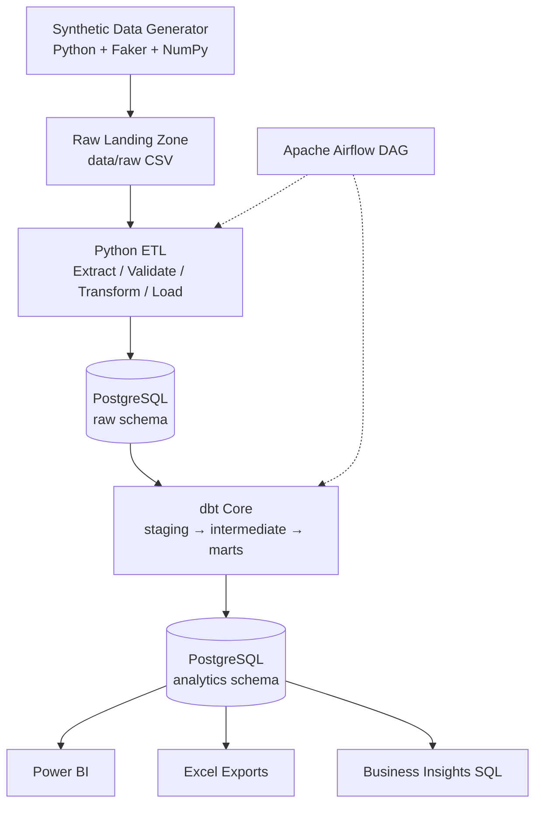

# Architecture — Pakistan E-commerce Analytics Platform

## Overview

The platform follows a classic **batch analytics** architecture with a clear separation between landing (raw), transformation (dbt), and consumption (analytics marts / Power BI).



## Layers

| Layer | Schema / Path | Purpose |
|-------|---------------|---------|
| Source | `data/raw` | Immutable landing files per batch |
| Raw warehouse | `raw.*` | 1:1 load of source with audit columns |
| Staging | `staging.*` (dbt views/tables) | Clean types, rename, light filters |
| Intermediate | `intermediate.*` | Reusable business logic |
| Analytics | `analytics.*` | Star schema for BI |
| Ops | `ops.*` | Pipeline runs & freshness |

## Design principles

1. **ELT-friendly**: Prefer loading raw data quickly, then transform in SQL/dbt.
2. **Star schema for BI**: Facts store measures; dimensions store descriptive attributes.
3. **Documented grain**: Every fact table has an explicit grain.
4. **Reproducibility**: Seeded synthetic generator + Dockerized PostgreSQL.
5. **No secrets in git**: Environment variables only.

## Orchestration flow

```text
Generate / Ingest Data
        ↓
Validate Raw Data
        ↓
Load PostgreSQL
        ↓
Run dbt
        ↓
Run Data Quality Checks
        ↓
Generate Analytics Exports
```

## Pakistan-specific modeling

- Geography: provinces (Punjab, Sindh, KP, Balochistan, ICT, AJK, GB) and major cities
- Currency: PKR
- Payment mix: high Cash on Delivery share (realistic for local e-commerce)
- Carriers: TCS, Leopards, M&P, etc. (illustrative names for synthetic logistics)

## Cloud extension (future)

```text
Object Storage (S3 / ADLS / GCS)
        ↓
Cloud ETL (Glue / ADF / Dataflow)
        ↓
Cloud Warehouse (Redshift / Synapse / BigQuery)
        ↓
dbt
        ↓
Power BI
```

No paid cloud resources are required for this portfolio version.
