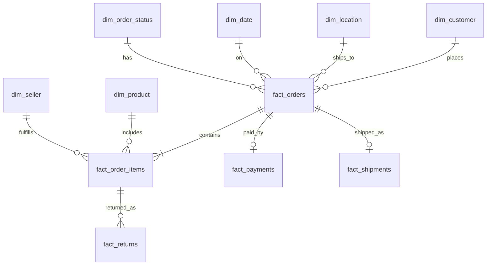

# Warehouse Design

## Schemas

| Schema | Role |
|--------|------|
| `raw` | Landing tables, 1:1 with source files + audit columns |
| `staging` | dbt cleaned/typed models |
| `intermediate` | dbt business building blocks |
| `analytics` | Star schema marts for BI |
| `ops` | Pipeline runs & freshness |

## ER (conceptual)

## Fact grains

| Fact | Grain |
|------|-------|
| fact_orders | one row per order |
| fact_order_items | one row per order item |
| fact_payments | one row per payment |
| fact_shipments | one row per shipment |
| fact_returns | one row per return |

## Indexes (raw layer)

Indexes on foreign keys and common filters (`order_date`, `order_status`, `payment_method`) are defined in `sql/ddl/raw_tables.sql` to speed loads and ad-hoc checks.

## SCD note

Current dimensions are Type 1 (overwrite). SCD Type 2 for sellers/customers is a documented future enhancement (`docs/final_report.md`).
